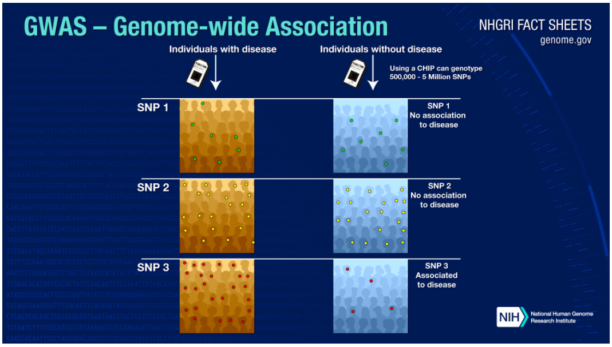

# Genomic Pipelines Basics

The process of making genomic data ready for analysis can be broken down into a couple of distinct stages.

  - Sequencing/Primary Analysis
  - Secondary Analysis
  - Tertiary Analysis

# Sequencing/Primary Analysis
At this stage, scientist extract DNA from a source such as tissue or saliva. Once the DNA is extracted, it's then **prepared** and **sequenced**. There are a couple of ways to perform sequencing today based on the required output:

  - Sanger Sequencing
  - Whole Exome Sequencing 
  - Whole Genome Sequencing

We will focus on Whole Genome Sequencing (WGS) in this overview.

## Prepare
Due to limitations with current sequencing technology, the first stage of processing requires the DNA molecule to be fragmented into smaller segments. These segments called **short reads** are about 100-200 base pairs long. To increase the confidence in the output, hundreds of copies of this short reads are duplicated. This redundancy as we'll see later is by design to increase output confidence. 

##Sequence
These short reads are then processed by the sequencing equipment which uses flouresence technology to read each base at a time. This process called **base calling**, results in a file based output called a **base call library**. Most sequencers include a post processing step that will convert this raw output to a user friendly format, and accounting for the **base call quality**. The more commonly used file formats include **FASTQ** or **uBAM**. This will be the starting point of most of the analysis that we'll perform. The FASTQ file has the base call quality for each base as one of it's values. Sequencing technology is not perfect, errors in base calling are not uncommon. 

Check the appendix for examples and detailed discussion of these file formats.

# Secondary Analysis
The next step in the process is to take these short reads and reassemble them to a represenation of the original genome. As you can imagine this is a fairly complex and computationally intensive process. This is made possible because the **Human Genome Project** produced a version of the human genome that's commonly accepted as the **reference genome**. FYI, this genome is not the genome of a single person but instead it's a composite genome of a group of people.

Think of this reference genome as the cover picture of a million piece jigsaw puzzle and the short reads as the individual pieces. The first step is to use computer algorithms to figure out where each short read fits in the original genome. As discussed earlier, there's usually more than one copy for each short read. As the alignment process continues to process the reads, the more short reads that cover a given area of the genome, the more confidence that the short reads are accurate and that they are accurately aligned. You will hear scientist and analyst talk of coverage with a given number say 50X. The higher the number, the more confidence in the sequence/alignment process. The more sensitive the use, the higher the coverage is expected.

There are different alignment tools out there, but the one that we'll use is called the **Borrows-Wheeler-Aligner(BWA)**. The final output of the aligment is a alignment map, usually represented as a **BAM file(.bam)**.

The last step in the secondary analysis is **variant calling**. Now that we have a representation of the sequenced genome, we compare that against the reference genome and find any areas where our genome of study varies from the reference genome. These areas are called **variants** and are the focus of subsequent analysis.

One thing to note, the presence of a variant does not indicate a problem, it's an area of interest. Most variants are **benign** (not disease causing), while some are **pathogenic** (disease causing). When performing downstream analysis, researchers can compare the variants against already identified and annotated variants.

There are many types of variants. Variants are usually classified based on the the number of bases involved. The smallest variant is a single base variant, commonly known as a **Single Nucleotide Variant(SNV)**. This type of variant is usually a change in the letter code of the DNA, for example where the reference genome might have a **T**, our genome of study might have a **C**. If a SNV is present in more than 1% of the population, it's referred to as a **Single Nucleotide Polymorphism(SNP)**.

Other common types of variants are **Insertions** and **Deletions**, also commonly referred to as **InDels**. These could be an insertion of a small number of bases or large number of bases.

The largest types of variants would be changes to the entire chromosome, these are called **Whole Chromosome Aneuploidy**. In some rare changes during cell division/multiplation (**Mitosis & Meisosis**), problems can result in either a loss of a chromosome (**monosomy**), or a gain of a chromosome(**Trisomy**). This a usually survivable but with corresponding health complications. For example, **Trisomy of Chromosome 21** results in an extra 21st chromosome which causes **Downs Syndrome**. In very rare cases, the process of **mitosis/meiosis** can result in a gain of a new chromosome for all 23 chromosomes, a condition called **Triploidy** or a loss of a single chromosome for all 23 chromosomes, a condition called **Monoploidy**. This are usually fatal and the cell doesn't survive.

Check the appendix for more information and examples of variants.

# Tertiary Analysis

Tertiary analysis is finally the step that we start to ask questions of the genomic data that we've acquired. One of the questions we'll try to answer here is whether any of the variants that we found in the previous section are associated with a particular disease.

One of the tools used to accomplish this is called a **Genome Wide Association Study(GWAS)**. So what's a **GWAS** and how is it conducted?

In a **GWAS** researchers will find two groups of people, one group that is known to have a particular attribute (could be a disease or any other physical attribute), and a control group that doesn't have the attribute. Both groups will have their DNA sequenced. The variants will then be analyzed, **GWAS** usually focus on **SNPs**.

Let's assume that the particular attribute of interest is caused by a particular SNP. You'd expect to see these SNPs in higher frequency in the affected group and in lower frequency in the control group. In the image below, you can see how concentration of **SNP 3** in the affected group is higher than in the control group. Therefore you can conclude that **SNP 3** is associated with the attribute of interest.

**GWAS** have been used successfully to identify genetic variations that contribute to risk for various diseases. For example, three independent studies [1] found that age-related macular degeneration (which leads to blindness) is associated with variation in the gene (**Complement Factor H**) which produces a protein involved in regulating inflammation.

Other diseases that have been studied and shown to be associated with genetic variation include:
  - Diabetes
  - Parkison's disease
  - Some heart disorders
  - Obesity
  - Crohn's disease
  - Response to anti-depressant medications

[1]: https://www.genome.gov/about-genomics/fact-sheets/Genome-Wide-Association-Studies-Fact-Sheet