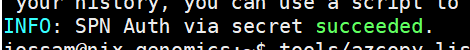

# Overview
Most customers have accumulated a large collection of genomic data that will need to be moved to the cloud. It's not uncommon to have customers with at least 1PB of data on premises. In addition to this initial snapshot, they are also producing new datasets daily. This data will also need to be moved to the cloud on a periodic basis.

For the initial snapshot, there are two commonly uses ways to migrate the data. We can use a storage device like **Azure Databox** or we can move the data over the wire using the customers current connectivity to **Azure**. Regardless of whether the customer has **Azure Express Route** or a **VPN Gateway**, this could work.

**Azure Databox** is not always the right or the fastest solution. It takes some time to acquire, copy and load the data. Depending on the data size and the customer's bandwith, sometimes moving the data over the wire is faster. Make sure you review both options and see which one works best for your scenario.

The choices for moving the periodic data loads are more clear cut. Given the frequency and the data size, moving the data over the wire is ideal.

For this quickstart we will focus on moving the data over the wire and demonstrate how to set up your infrastructure. For moving the initial snapshot, we'll use **Azure AzCopy**. For the differential data we'll use **Azure Databox Gateway**.

# Using AzCopy to move snapshot data

AzCopy is a command-line utility that you can use to copy blobs or files to or from a storage account. AzCopy is cross-platform, executables are available Windows, Linux and MacOS.

Instead of repeating the [documentation](https://docs.microsoft.com/en-us/azure/storage/common/storage-use-azcopy-v10?toc=/azure/storage/blobs/toc.json), please use it for download & setup instructions.

In order to access your storage account, you will need to choose what type of **scecurity principal** you are going to use. AzCopy supports **user identity**, **managed identity** and **service principal**. Because we are running the load process from outside of **Azure**, and we'll be automating the process, we'll use a **service principal**. We'll make sure the **service principal** has the appropriate roled to read/write data to the storage account. We'll use the **Storage Blob Data Contributor** role.

## Service Principal configuration

If you don't have a **service principal** follow this [guide](https://docs.microsoft.com/en-us/azure/active-directory/develop/app-objects-and-service-principals) to learn more and set one up.

Once you have one handy, there are a few minor configurations that you'll need to start using this on your VM. We'll run through the set up on an Ubuntu 20.18 VM. Follow the documentation if you are running on Windows or MacOS.

There are two components of the service principal that you'll need. You need the **application(client-id)** and the corrresponding **client-secret**.

Create an enviroment variable called **AZCOPY_SPA_CLIENT_SECRET** and set the value to your client-secret.

```console
AZCOPY_SPA_CLIENT_SECRET=*********-JZe0675*********
```

Once the secret is set, you can now use azcopy to login in as the **service principal**

```console
azcopy login --service-principal  --application-id <your-client-id> --tenant-id <your-tenant-id>
```

If you were successful, you'll see a message  similiar to this:




Now that you can log in, try running a simple command to test connectivity to your storage account. For example, this command will list out the contents of the given container.

```console
azcopy list https://<account>.blob.core.windows.net/<container>
```

Great, you now have access to your **Azure Storage** account from your private network. Moving files from your private network to **Azure** can not be accomplishes by running the **azcopy copy** command. Here's an example that copies the content of an entire directory.

```console
azcopy copy '/datadrive/1000-genomes' 'https://mystorageaccount.blob.core.windows.net/1000-genomes' --recursive
```

Refer to the [documentation](https://docs.microsoft.com/en-us/azure/storage/common/storage-use-azcopy-blobs-upload?toc=/azure/storage/blobs/toc.json) for syntax and additional examples.

Moving large files over the wire has some complexities which **AzCopy** is designed to address. Here are a few things that we've found to be helpful.

- Do run [benchmark](https://docs.microsoft.com/en-us/azure/storage/common/storage-ref-azcopy-bench). This will test connectivity between source/destination and will simulate loading some test files. The output will help you understand the expected throughput and help you right size your VM.
- Orchestrate and monitor your jobs using  scheduler or orchestrator. **Azure Data Factory** could be used to trigger and monitor jobs.
- Check for **failed** jobs and **resume** them. File uploads will fail for various reasons. Monitor your jobs and resume any jobs that fail. AzCopy resume feature will look at the job plan to figure out which files should be restarted.


# Using Azure DataBox Gateway to move periodic data


