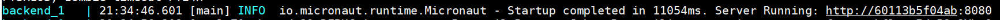

# Overview

[Nextflow](https://github.com/nextflow-io/nextflow) is a bioinformatics workflow manager that enables the development of portable and reproducible workflows. Using Nextflow, you can deploy workflows on a variety of execution platforms including local, Kubernetes clusters and also on HPC. For this quickstart we will deploy our workflows to Azure Batch.

# Nextflow on Azure

Nextflow on Azure has very few moving parts making it relatively easy to get started. Nextflow will run on any POSIX compatible system, we'll use an Ubuntu 18.04 running on Azure but you can also run this on a Windows 10 machine, using  [WSL](https://docs.microsoft.com/en-us/windows/wsl/about). Nextflow also requires Bash 3.2 (or later) and Java 8 (or later, up to 15).

We are going to use Azure Batch as the executor. For the execution in a cluster of computers the use of a shared file system is required to allow the sharing of the task's input/output files.

At the time of this writing, Azure support for Nextflow on Azure is still in public preview. The installation instructions will be slightly different once it's generally available. For the rest of the install, we'll reference documentation found in [this install guide](https://www.nextflow.io/docs/edge/index.html).

## GA Install Instructions:

```shell
curl -s https://get.nextflow.io | bash
```

## Edge-Release (Public Preview) Install Instructions

The support for Azure Cloud requires Nextflow version 21.02.0-edge or later. If you don’t have it installed, use the following command to download it in your computer:

```shell
export NXF_EDGE=1
curl get.nextflow.io | bash
```

After running the above, command check the version of Nextflow installed by running this command.

```shell
nextflow -v
```

If the version is not the current release version, which it may not be, then you'll have one additional installation requirement.
- Go to the [Nextflow releases page](https://github.com/nextflow-io/nextflow/releases) on Github.
- Under the **Assets** header, get the nextflow.{version}-edge-all url.
- On a terminal window, run the following command with the asset URL.
  - ```shell
    wget -qO- ASSET-URL-FROM-ABOVE | bash
    ```
This should install the latest release version of Nextflow.

## Running Nextflow on Azure

Before we run any pipelines on Azure, let's run through a [basic pipeline example](https://www.nextflow.io/example1.html) running locallly to make sure everything's working as intended. This is also a good introduction to Nextflow.

### Running a basic pipeline locally

For a detailed introduction to Nextflow, use [this](https://www.nextflow.io/docs/latest/basic.html) guide.

Nextflow is based on the **dataflow** programming model. A Nextflow pipeline is made up of a series of processes that communicate through channels. 

The example below has two processes, **splitSequences** and **reverse**. Each process is made up of an **input** channel, an **output** channel and a script execution block.

Any input parameters that are required can be passed in using the **params.** syntax. For example **params.in**, will create an input parameter called **in**.

```bash
#!/usr/bin/env nextflow
 
params.in = "$baseDir/data/sample.fa"

/*
 * split a fasta file in multiple files
 */
process splitSequences {
 
    input:
    path 'input.fa' from params.in
 
    output:
    path 'seq_*' into records
 
    """
    awk '/^>/{f="seq_"++d} {print > f}' < input.fa
    """
}

/*
 * Simple reverse the sequences
 */
process reverse {
 
    input:
    path x from records
     
    output:
    stdout into result
 
    """
    cat $x | rev
    """
}
 
/*
 * print the channel content
 */
result.subscribe { println it }
```

Save this script as a nextflow file (**.nf**). In the same folder as your script file, create a folder called **data** and save a fasta file called **sample.fa** in that folder. That's it, you can now run your basic pipeline and see it print the reverse of your **sample.fa** sequence.

Run this in your working directory. If you see any errors, check for syntax issues with the script first.

```bash
nextflow run main.nf
```

### Running a pipeline on Azure

Nextflow on Azure requires at minimum two Azure services, [**Azure Batch**](https://docs.microsoft.com/en-us/azure/batch/batch-account-create-portal)  and [**Azure Storage**](https://docs.microsoft.com/en-us/azure/storage/common/storage-account-create). Follow the guides below to set up both services on Azure.

For this example, we will use a more complicated pipeline which can be found on [Github](https://github.com/nextflow-io/rnatoy). You can clone this repo to a local working folder.

Next, we'll edit the **nextflow.config** file, to add Azure specific parameters, use this [guide](https://www.nextflow.io/blog/2021/introducing-nextflow-for-azure-batch.html) for additional information. Your config file will look something like this.

```bash
plugins {
  id 'nf-azure'
}

process {
  executor = 'azurebatch'
  container = 'nextflow/rnatoy@sha256:9ac0345b5851b2b20913cb4e6d469df77cf1232bafcadf8fd929535614a85c75'
}

azure {
  batch {
    location = 'westeurope'
    accountName = '<YOUR BATCH ACCOUNT NAME>'
    accountKey = '<YOUR BATCH ACCOUNT KEY>'
    autoPoolMode = true
  }
  storage {
    accountName = "<YOUR STORAGE ACCOUNT NAME>"
    accountKey = "<YOUR STORAGE ACCOUNT KEY>"
  }
}

profiles {
  aztest {
    params.reads = "az://cbcrg-eu/ggal/*_{1,2}.fq"
    params.annot = "az://cbcrg-eu/ggal/ggal_1_48850000_49020000.bed.gff"
    params.genome = "az://cbcrg-eu/ggal/ggal_1_48850000_49020000.Ggal71.500bpflank.fa"
  }
}
```
Follow the steps in the documentation to get your storage and batch account names and keys.

Create a container called **cbcrg-eu** and then copy the **ggal** folder in the local folder to the container on Azure. All the files referenced by this pipeline will be in that folder. If everything is properly configured, running the following command will kickoff the pipeline on Azure. Nextflow will print out the output on the console, but you can also log into the portal or use **Azure Batch Explorer** to check the progress of your job. FYI, this job will take about 10 minutes to complete.

```bash
./nextflow run rnatoy -w az://cbcrg-eu/work
```

We are passing the working directory as a parameter, but this could be specified in the **nextflow.config** file. Check this [guide](https://www.nextflow.io/docs/edge/azure.html) for more details on the configuration options available.

As with all Azure services, be aware of the cost of various services especially for long running projects.

## Automate running pipelines using Nextflow Tower

Running Nextflow from command line is good for development, testing and debugging. Once your pipeline is ready for production use you'll want to automate the process of executing and monitoring the service; we are going to use **Nextflow Tower** for this. Nextflow Tower allows you to monitor the execution of any of your Nextflow data analysis pipelines.

[**Seqera Labs**](), the team behind **Nextflow Tower**, provide a couple of different options for running **Nextflow Tower**.
- Paid SASS service (Ideal for production workloads).
- Free SASS service (Ideal for dev/test workloads).
- Open source code you can download and run on your network.

At the moment of this writing, the SASS services are in preview and require you to sign up for access. Although I'm going to show you to stand this up on your network, I highly recommend using the paid service for production workloads.

### Installing Nextflow Tower on an Ubuntu 18.04 VM

Before you get started, make sure you have met the following requirements :
- You will need **Java 8**, I used OpenJDK. Make sure you have the JDK installed, needs some jar files not in JRE.
- You will need **Docker engine**, and **Docker Compose** installed.
- You will need **make** installed, it's not installed by default on Ubuntu 18.04.
- You will need an **SMTP Relay** service.
  - The easiest option is to use a SASS services line [SendGrid](https://sendgrid.com/).
    - The free sendgrid tier should be enough for what we need.
    - Follow the process to create a validated user, this account will be your **sender** account.
    - Use the SMTP Relay option and capture your host/port/user/password information.
    - You will use this information later when setting up **Nextflow Tower**
    - **Nextflow Tower** will this service to send emails during the authentication/authorization process.

The code & installation instructions for installing a NextFlow Tower are available on [Github](https://github.com/seqeralabs/nf-tower).

Follow the instructions to **download** and **make** the installation package.

Before you run the **make run** command, create a **tower.yml** file in the **nf-tower** folder and provide the following values:

```shell
TOWER_CONTACT_EMAIL: {your-sendgrid-validated-user}
TOWER_SMTP_HOST: smtp.sendgrid.net
TOWER_SMTP_PORT: 587
TOWER_SMTP_USER: {your-sendgrid-user, should be "apikey"}
TOWER_SMTP_PASSWORD: {your-sendgrid-password}
TOWER_SERVER_URL: http://{your-vm-public-ip}:8000
```

If everything works well, you'll see the following line as your last line in the output window.



Congratulations! Before you break for a cold brew, test to make sure you can launch your **Nextflow Tower** installation by going to http://{your-vm-public-ip}:8000. Follow the instructions to sign-in to your **Nextflow Tower** installation. On successful sign-in, you will see the **Get Started** guide that walks your through the steps required to run your workflows on your **Nextflow Tower** instance.

The **TOWER_ACCESS_TOKEN** links your local nextflow to your Tower instance. You can get your token for your local instance by going to http://{your-vm-public-ip}:8000/tokens.

Since Azure support for Nextflow on Azure was just recently added, the NXF_VER will be the **edge** version that you installed when your first set up Nextflow. For example, I used **21.03.0-edge**.

```shell
export TOWER_ACCESS_TOKEN=<YOUR ACCESS TOKEN>
export NXF_VER=20.10.0
```

## Running your first workflow on Nextflow Tower

If you followed the steps in the previous sections, you have a functional **Nextflow Tower** install and you also have a local basic workflow that you can use to test the installation.

With your installation running, go to your **basic workflow** working directory from the earlier steps and run the following commands.

```shell
nextflow run basic -with-tower http://{your-vm-public-ip}:8000/apis
```

That should send your run to the tower instance. You should now see your job with all it's information on your Tower instance dashboard.
